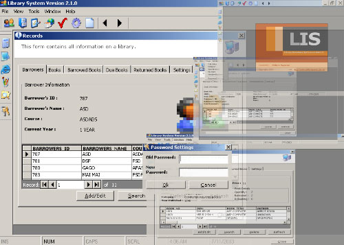



## \_A Simple Library Inventory System / Using ADO

### Description

Dear friend, Im Philip V. Naparan a 17 yr old programmer from Philippines and you can visit my website www.philipnaparan.cjb.net for more info about me.This program that i have been uploaded is a simple program that i have created in just 2 days. This program help more to those beginner in vb programming to introduce to them the basic concept of relational database using ADO.This program include the use of adodc control and database connection in runtime(not in design view). Download this and it will help you a lot. By the way dont for get to vote this program.Thank you, happy exploring it and GOD bless. ITOY GAWANG PINOY!        *NOTE: THIS IS CODED FOR BEGINNERS ONLY..............
 
### More Info
 

             |
---                |---
**Submitted On**   |2003-07-11 04:24:40
**By**             |[Philip  V\. Naparan :\-\)](https://github.com/Planet-Source-Code/PSCIndex/blob/master/ByAuthor/philip-v-naparan.md)
**Level**          |Beginner
**User Rating**    |4.6 (387 globes from 84 users)
**Compatibility**  |VB 3\.0, VB 4\.0 \(16\-bit\), VB 4\.0 \(32\-bit\), VB 5\.0, VB 6\.0
**Category**       |[Complete Applications](https://github.com/Planet-Source-Code/PSCIndex/blob/master/ByCategory/complete-applications__1-27.md)
**World**          |[Visual Basic](https://github.com/Planet-Source-Code/PSCIndex/blob/master/ByWorld/visual-basic.md)
**Archive File**   |[\_A\_Simple\_1726623302004\.zip](https://github.com/Planet-Source-Code/philip-v-naparan-a-simple-library-inventory-system-using-ado__1-46951/archive/master.zip)

